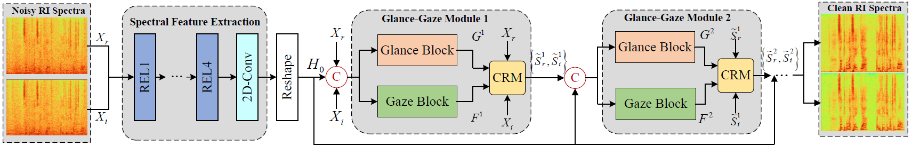
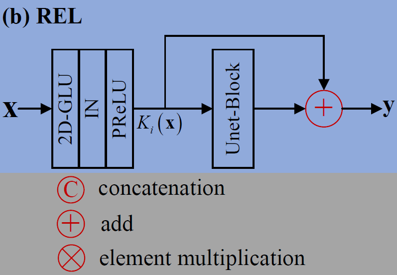
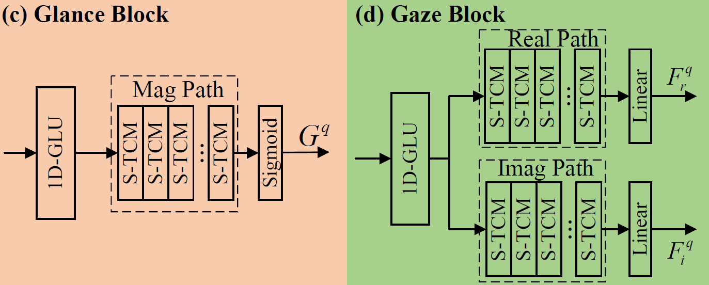
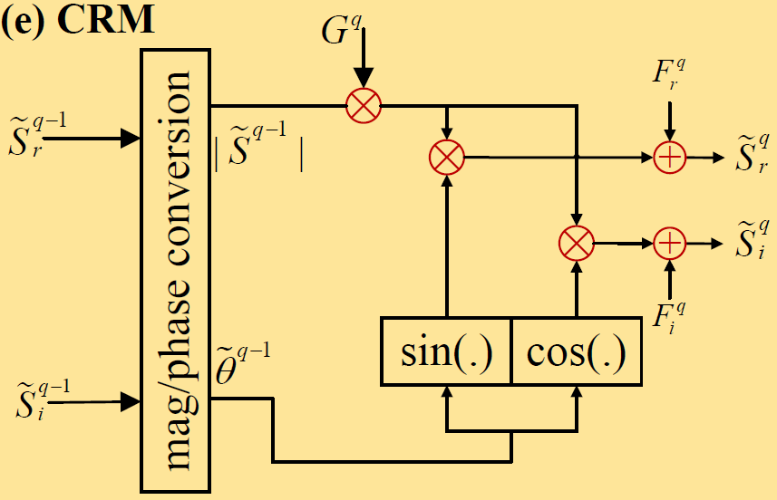
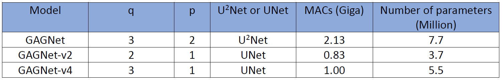
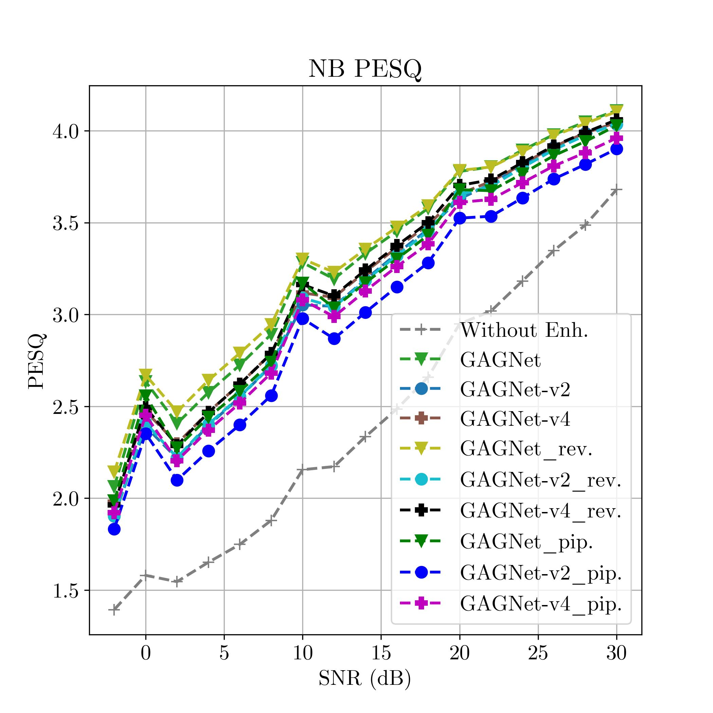
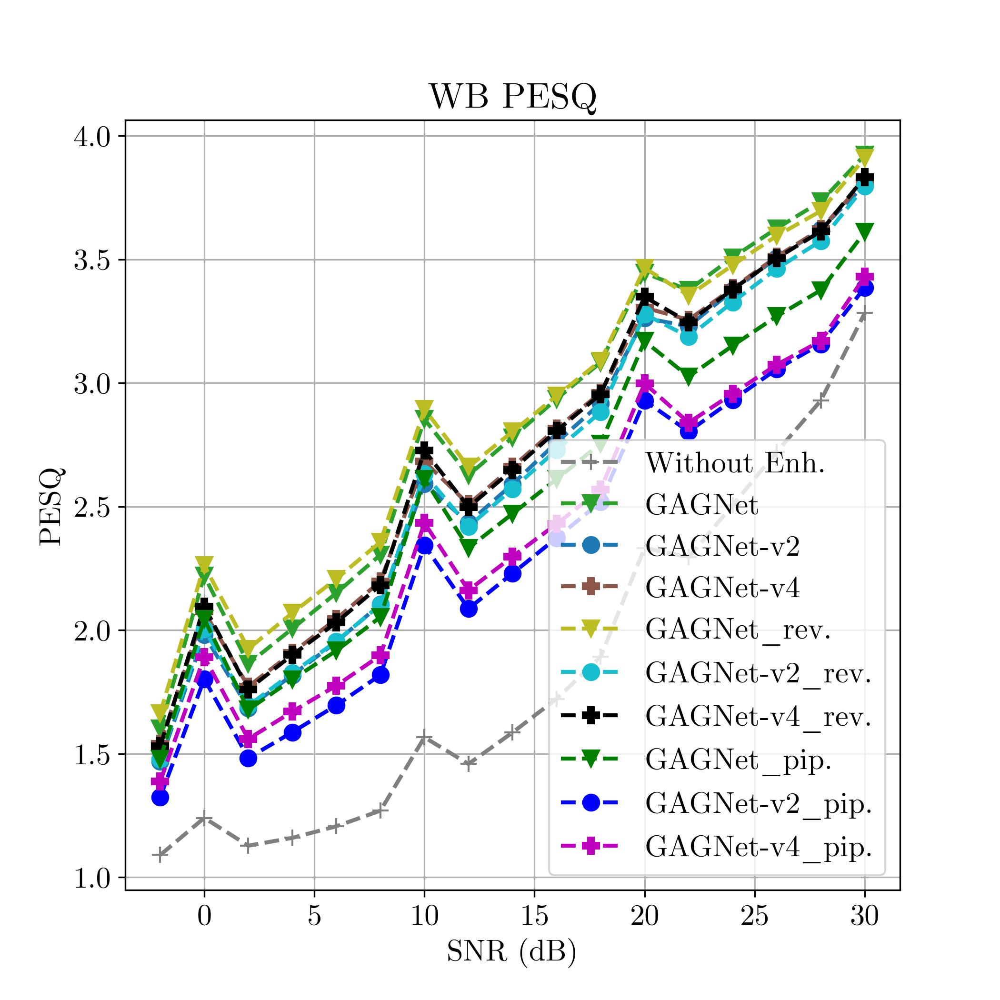
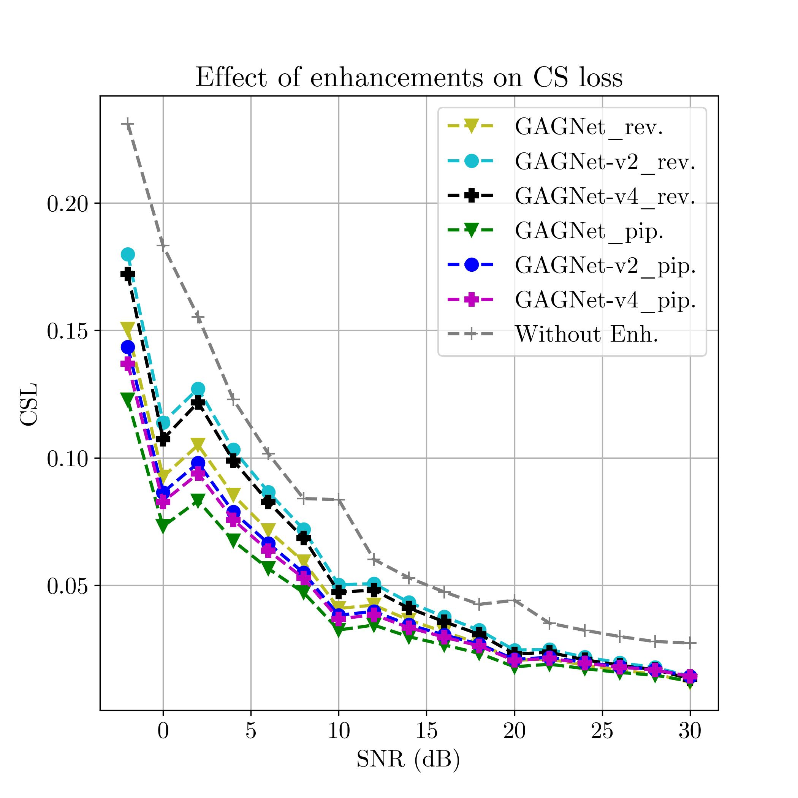
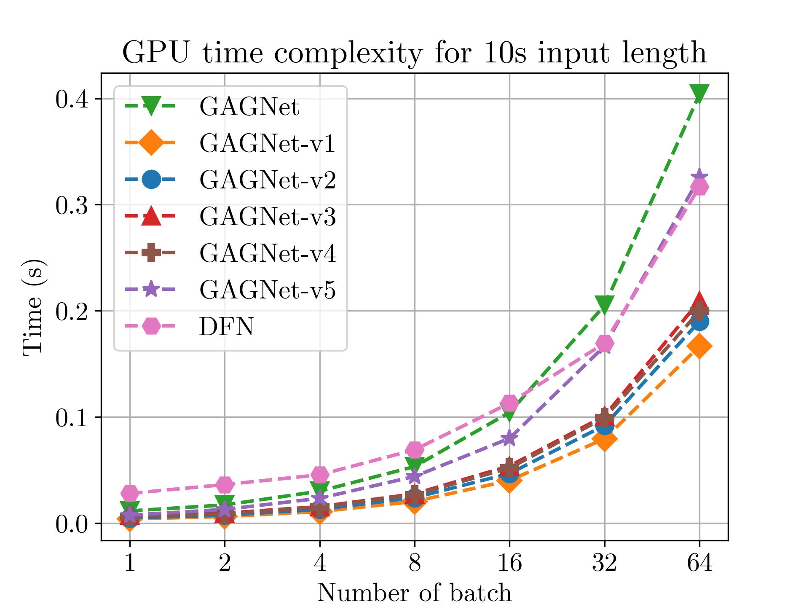

# Electronics Research Institute, Sharif University of Technology

## GAGNet: Glance and Gaze Network for Monaural Speech Enhancement
<div align="justify">
  GAGNet is a deep learning-based technique for monaural speech enhancement that leverages the human hearing system's ability to focus on local information provided in the speech signal while capturing contextual, and global features.
</div>


## Block Diagram
The overall architecture of the implemented model is shown below:

<p align="center"></p>

## Table of Contents
- [Overview](#overview)
- [Dataset](#dataset)
- [GAGNet versions](#gagnet_versions)
- [Requirements](#requirements)
- [Usage](#usage)
- [Results](#results)
- [Contribution](#contribution)
- [License](#license)

## Overview
As presented above, GAGNet contains two main modules: Featrure Extraction Module (FEM) and the stack of Glance-Gaze Modules (GGMs). 

**Input/Target:** Speech (or generally audio) has various ways to be represented, going from raw time series to time-frequency representations. Selection of an approriate representation plays a crucial role in the overall performance of your system. In the time-frequency domain, spectrogram has been proved to be a useful choice. Spectrograms consist in 2D image-like structures representing sequences of Short Time Fourier Transform (STFT) with time and frequency as axes, while brightness shows the strength of each frequency component at each time. Spectrograms include magnitude and phase components that each of them includes useful information during the enhancement process. In this project, despite previous techniques adopting only magnitude of the spectrogram, both magnitude and phase are utilized to provide a comprehensive method for speech enhancement as it has been shown that phase-inclusion during speech enhancement improves the results.

**Feature Extraction Module (FEM):** As its name suggests, this module aims at extracting features from inputs. To mitigate the problem of information loss due to consecutive downsampling operators in the previously suggested encoders (feature extractors) and the issue of overlooking contextual information caused by small kernel size, inspired by U<sup>2</sup>Net normal 2D convolutional layers are replaced by recalibrated encoder layers (RELs). FEM mainly consists of a 2D-GLU, instance normalization (IN), PReLU, and a UNet block with the residual connection as shown in the figure below: 


<p align="center">
  
</p>


**Glance-Gaze Module (GGM):** The motivation behind GGM is stemmed from the phusiological phenomenon that human can pay attention to both global and local components concurrently. So, two parallel block are designed accordingly, namely Glance Block (GLB) and Gaze Block (GAB). GLB estimates a gain function to suppress the noise in the magnitude domain, leading to the _glance_ towards the overall spectrum. At the same time, GAB seeks a residual to repair the spectral details in the complex domain, which serves as the _gaze_ operation. Both outputs are then applied to the collaborative reconstruction module (CRM) to obtain the spectrum estimation. Moreover, to adopt the multi-stage training strategy, multiple GGMs are repeatedly stacked and the RI (Real and Imaginary) components of current stage are iteratively updated based on that of the last stage. The structure of GLB and GAB are shown in the figure below: 

      
<p align="center">
  
</p>

<div align="justify"> 
  Note: In the figure, S-TCM stands for the Squeezed version of Temporal Convolutional Module.
</div>


**Note**: In the above figure, S-TCM stands for the Squeezed version of Temporal Convolutional Module.


**Collaborative Reconstruction Module (CRM):** This module uses and combines the outputs of GGMs and estimates the RI spectrum as shown in the figure below:

<p align="center">
  
</p>

For more information, click [here](https://arxiv.org/abs/2106.11789).


## Dataset 
**Note1: For train, test, and evaluation of the models, you should put unzipped data in [**Noisy_Dataset_V1**](./dataset/Noisy_Dataset_V1),  [**Noisy_Dataset_V2**](./dataset/Noisy_Dataset_V2) and [**simulated_rirs**](./dataset/simulated_rirs).**

**Note2: For running the codes, it is necessary to unzip test_filenames.zip, valid_filenames.zip and train_filenames_v2.zip files in this [**folder**](./dataset)**

**Note3: For each specific dataset, it is necessary to create train_filenames_v2.csv, test_filenames.csv, and valid_filenames.csv based on the path of your dataset in this [**folder**](./dataset).**

This [**folder**](./dataset) contains the project dataset for Speech Enhancement **(SE)**.

Approximately 4.6 million mp3 files were gathered from a noiseless Persian language and noise dataset for this project. The creation of the noisy data involved using reverb data, the QUT dataset, and the noisy data received from the employer as the pure noise dataset. Reverb data includes the reverberation of rooms of various sizes, and the QUT dataset contains 5 different types of noise (home, cafe, street, etc.). To generate the SE dataset, we initially extracted the speech portions from a subset of the Common Voice dataset. This data represents the noise-free section of the DS-Fa-v03 dataset. Noise samples were generated by utilizing data from both the real QUT noise dataset and noise data created by the employer. The noise-free part of DS-Fa-v03 dataset with different SNRs from **-2** to **30** dB with **2** steps with QUT data, and from **6** to **20** dB with **2** steps and extra levels **0, 25, 30** dB, only for the train part, from with the employer-created noise was mixed. During training and evaluation, we enriched our dataset by convolving randomly reverb data with 50% of the train and test sections of the DS-Fa-v03 dataset. This dataset is named **DS-Fa-v03_reverbed**. To inform more about our dataset, please, see the Phase-3 report.

```
DS-Fa-v03
	├── -2dB 
	│   ├── common_voice_fa_18202356SPLITCAR-WINUPB-1SPLIT0dB.mp3
	│   ├── common_voice_fa_18202357SPLITCAFE-CAFE-1SPLIT0dB.mp3
	│   ├── common_voice_fa_18202375SPLITREVERB-CARPARK-2SPLIT0dB.mp3	 	 
	│   ├──    .
	│   ├──    .	 	 
	│   └── common_voice_fa_18202378SPLITCAFE-CAFE-1SPLIT0dB.mp3
	├── 0 dB 
	│   ├── common_voice_fa_18202356SPLITCAR-WINUPB-1SPLIT0dB.mp3
	│   ├── common_voice_fa_18202357SPLITCAFE-CAFE-1SPLIT0dB.mp3
	│   ├── common_voice_fa_18202375SPLITREVERB-CARPARK-2SPLIT0dB.mp3	 	 
	│   ├──    .
	│   ├──    .	 	 
	│   └── common_voice_fa_18202378SPLITCAFE-CAFE-1SPLIT0dB.mp3
        .
        .
        .
        .
	├── 30 dB 
	│   ├── common_voice_fa_18202356SPLITCAR-WINUPB-1SPLIT0dB.mp3
	│   ├── common_voice_fa_18202357SPLITCAFE-CAFE-1SPLIT0dB.mp3
	│   ├── common_voice_fa_18202375SPLITREVERB-CARPARK-2SPLIT0dB.mp3	 	 
	│   ├──    .
	│   ├──    .	 	 
	│   └── common_voice_fa_18202378SPLITCAFE-CAFE-1SPLIT0dB.mp3
	└── InfdB
	    ├── common_voice_fa_18202356SPLITCAR-WINUPB-1SPLIT0dB.mp3
	    ├── common_voice_fa_18202357SPLITCAFE-CAFE-1SPLIT0dB.mp3
	    ├── common_voice_fa_18202375SPLITREVERB-CARPARK-2SPLIT0dB.mp3	 	 
	    ├──    .
	    ├──    .	 	 
	    └── common_voice_fa_18202378SPLITCAFE-CAFE-1SPLIT0dB.mp3

```
### Data collection procedure

In this project,the CommonVoice Persian version 13 database has been used to build a proper VAD database in Persian language.
CommonVoice is an open source project started by Mozilla to collect speech data, where people can speak sentences.

```bibtex
@article{nezami2019shemo,
  title={ShEMO: a large-scale validated database for Persian speech emotion detection},
  author={Nezami, Omid Mohamad and Lou, Paria Jamshid and Karami, Mansoureh},
  journal={Language Resources and Evaluation},
  volume={53},
  number={1},
  pages={1--16},
  year={2019},
  publisher={Springer}
}
```

## GAGNet_versions
According to GAGNet components, we have created different versions. These components are the number of GGMs (**q**), the number of S-TCM in each GGM (**p**) and using U<sup>2</sup>Net or UNet. These versions with their number of parameters and MACs are shown below:

<p align="center"></p>

## Requirements
- python (version 3.9.16).
- torch (version 2.0.1).
- torchaudio (version 2.0.2).
- other dependencies.

**Run the following code to install all the requirements and dependencies.**
```
pip install -r requirements.txt
```

## Usage
### Train, Evaluate, Test and Deploy Model
#### 1. Run the following code with the desired settings to train the model: ####

```bash                  
python train.py -model_name  [name of GAGNet models]
                -data_path   [path of main file of data]
                -data_cfg    [path to .json data configuration file]
                -train_cfg   [config of parameters for training]
                -ecoder_ckp  [path for loading checkpoints of Hamrah encoder]
```

#### For example: ####

```bash                  
python train.py -model_name "gagnet-v4"
                -data_path "./dataset"
                -data_cfg "./recipes/dataio.json"
                -train_cfg "./recipes/training.json"
                -ecoder_ckp "./checkpoints/ASR-Model/asr-encoder.ckpt"
```
	
#### 2. Run the following code with the desired settings to evaluate the PESQ: ####

```bash                  
python evaluate_PESQ.py -model_name  [name of GAGNet models]
                        -data_path   [path of main file of data]
                        -data_cfg    [path to .json data configuration file]
```

#### For example: ####

```bash                  
python evaluate_PESQ.py -model_name "gagnet-v4"
                        -data_path "./dataset"
                        -data_cfg "./recipes/dataio.json"
```

#### 3. Run the following code with the desired settings to evaluate the encoder or enhancement loss: ####

```bash                  
python evaluate_PESQ.py -model_name  [name of GAGNet models]
                        -data_path   [path of main file of data]
                        -data_cfg    [path to .json data configuration file]
                        -ecoder_ckp  [path for loading checkpoints of Hamrah encoder]
                        -pip_loss    [True: evaluate encoder loss, False: enhancement loss]
```

#### For example: ####

```bash                  
python evaluate_loss.py -model_name "gagnet-v4"
                        -data_path "./dataset"
                        -data_cfg "./recipes/dataio.json"
                        -ecoder_ckp "./checkpoints/ASR-Model/asr-encoder.ckpt"
                        -pip_loss True
```


#### 4. Run the following code with the desired settings to inference the model: ####

```bash
python inference.py -model_name     [name of GAGNet models]
                    -demo_path      [path of demo file of samples]
                    -samples_file   [name of samples file to load samples in demo file]
                    -enhanced_file  [name of enhanced file to save enhanced samples in demo file]
```
#### For example: ####

```bash
python inference.py -model_name "gagnet-v4"
                    -demo_path "./demo"
                    -samples_file "samples"
                    -enhanced_file "enhanced_samples"
```

## Results
We have extensively tested and evaluated GAGNet in different versions by changing the number of Glance-Gaze blocks (q) and groups of S-TCMs (p). In terms of effectiveness, efficiency, and enhanced speech quality, GAGNet's results indicate competitive performance.

**Note:** Name of models without suffix denotes the train process with DS-FA-v01 dataset and not using encoder in training. The model's name with the suffix indicates that it was trained using the DS-FA-v03_reverbed dataset. Models ending in ".pip." suffix utilized the encoder during training, while those with ".rev." suffix did not.

## PESQ
In this section, the results of GAGNet models on Narrow and Wide Band PESQ (Perceptual Evaluation of Speech Quality) criteria are shown below:
<p align="center"></p>
<p align="center"></p>

## Cosine Similarity Loss (CSL)
In this section, the results of GAGNet models on Cosine Similarity Loss (CSL) are shown below:
<p align="center"></p>

## Time complexity
In this section, the GPU time complexity results of GAGNet models are shown below:
<p align="center"></p>

## Contribution
We welcome contributions from the community! If you would like to contribute to GAGNet, please follow these steps:
1. Fork the repository.
2. Create a new branch for your feature or bug fix.
3. Commit your changes and push your branch to your fork.
4. Submit a pull request with a detailed description of your changes.

## License
Ⓒ 2023 X. All rights reserved. 